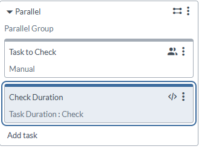
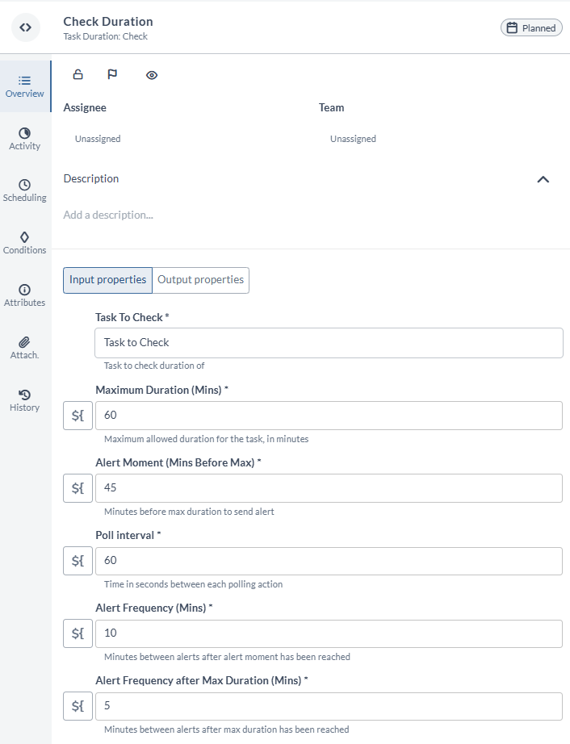

# Task Duration Check Plugin

## Preface

This document describes the functionality provided by the Digital.ai Release Task Duration Check plugin.

See the [Digital.ai Release reference manual](https://docs.digital.ai) for background information on Digital.ai Release and release automation concepts.

## Overview

The Task Duration Check plugin is meant to act as a gatekeeper on the duration of a task. 
Imagine you have a long running task, that typically runs for multiple hours. You want to ensure that the task does not run over, because you might be limited to a deployment window. 
The Task Duration Check will retrieve the start date and time from the task, and, with the given maximum duration, will let you know when the task is about to run over.

## Requirements

* Digital.ai Release v24.3.x

## Installation

* Install the latest JAR file from the [releases page](https://github.com/xebialabs-community/xlr-task-duration-check-plugin/releases) via the Plugin Manager.
* Or copy the latest jar into the `XL_RELEASE_SERVER/plugins/__local__` directory.
* Then restart the XL Release server.

## Features/Usage/Types/Tasks

This plugin provides one task, Check Duration, which is meant to be run alongside another task in a parallel group. 
The task will check the duration of the task you identify and will keep a tab on how long the task actually runs. 
Ensure that this task has a person or team assigned, to ensure that the notifications arrive. These will be delivered via a comment in the task, which, by default, triggers an email to the Assignee or a Watcher.

### Input
- *Task to Check* - The name of the task to check the duration of
- *Maximum Duration* - The maximum duration the task should run (in minutes)
- *Alert Moment* - When to alert if the task duration is to long. This is a time in minutes before the Maximum Duration
- *Poll Interval* - Frequency of checking how long the task should be running
- *Alert Frequency* - Frequency of alerts (in minutes) after Alert Treshold has passed
- *Alert Frequency Max* - Frequency of alerts (in minutes) after Maximum Duration has been reached

## References

